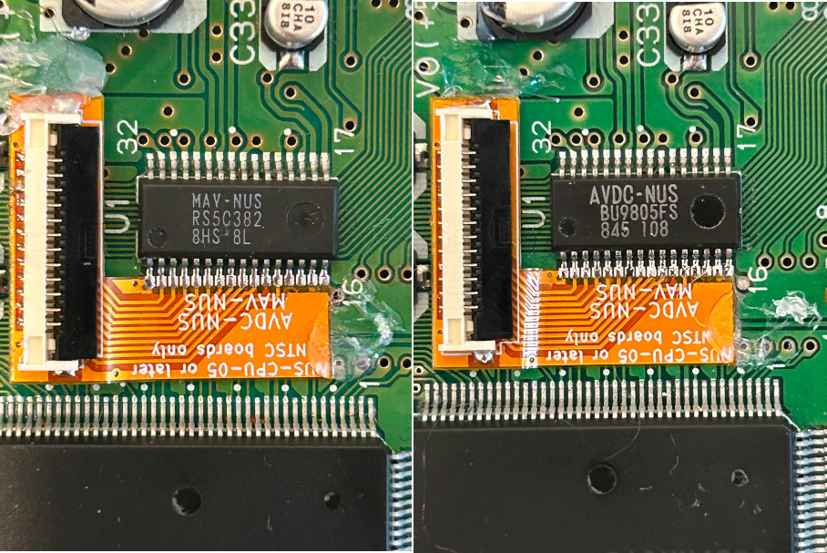

# MAV-NUS/AVDC-NUS adapter v3

Oh hey, let's design part of this circuit around flat flex boards. What could possibly go wrong?

## Assembly/installation instructions

If your fab is too dumb to look at the Gerber outputs: the B.Fab Gerber contains the outline for the stiffener,
which should be 1.2mm FR4. An adhesive layer (0.2mm or so) should be applied on top of that stiffener so the
adapter can be held in place while you solder it.

**Since the PCB is flat flex, you should order as many as possible to save on manufacturing costs, as FFC PCBs are very expensive.**

After 10 rounds of emails with your fab of choice, and about a hundred dollars, wait for the adapters to show up.

Now solder a flat flex connector to it (Molex 200528-0120), and you've completed the easiest part of the whole process.

Bend the flat flex so that the pins will be flush with the MAV-NUS, then peel off the adhesive backing and stick the thing to the board.

The rest of it involves drag soldering, checking for bridges, and testing the N64 over composite to catch any issues.

**It is VITAL that you get this drag solder job right on the first try!** Remember that flat flex boards are very fragile. Constant attempts to
fix the solder joints or otherwise physically abusing the adapter will cause the castellated holes to break off from the rest of the board,
rendering the whole thing useless. If, after a certain number of attempts, you can't get a good signal off the rugby64 (bad sync/video artifacts),
then there's a chance the adapter is broken and you need to try again.

When satisfied with the results, proceed to rugby64 installation.
