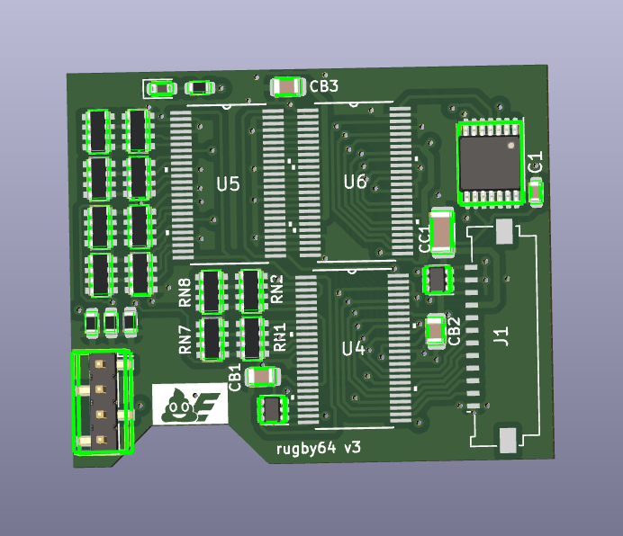
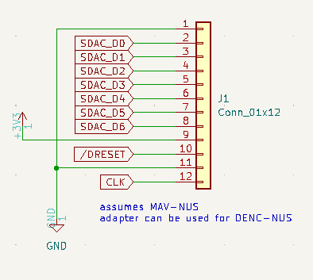
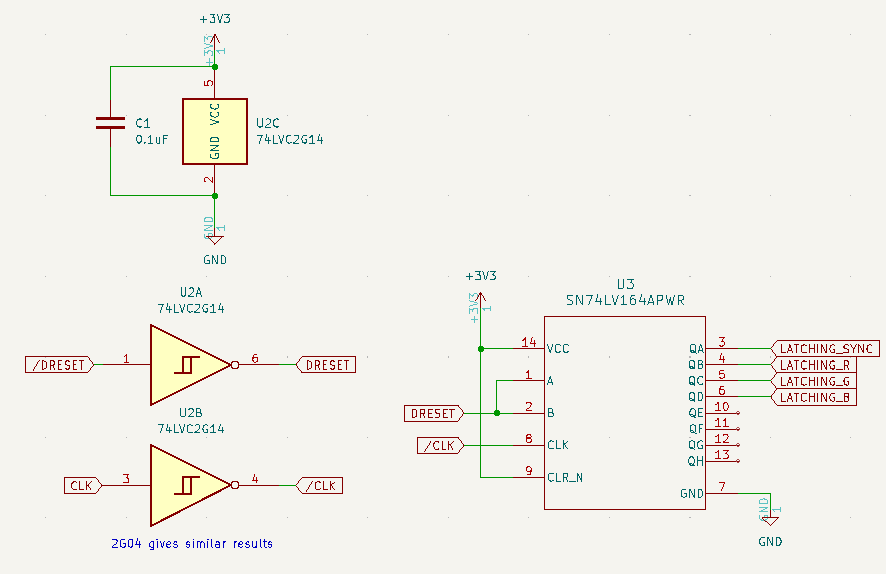
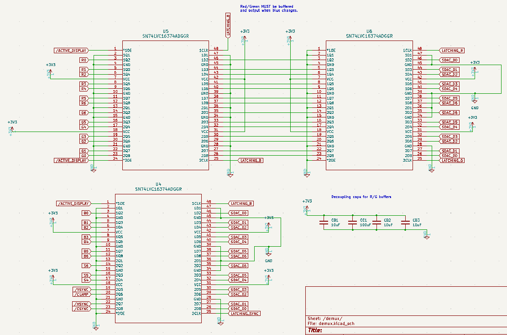
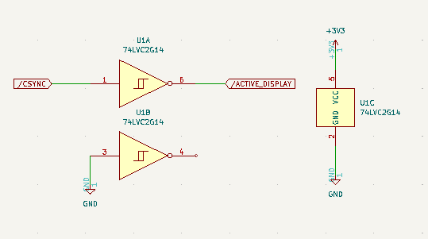
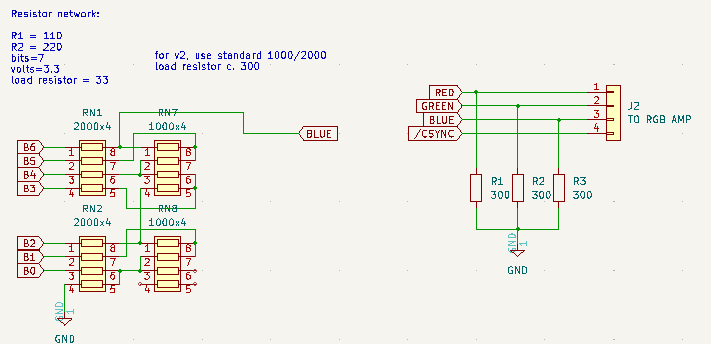

# rugby64 v3

It's the rugby64 TTL variant.

## DANGER: THIS SHIT'S UNTESTED

I haven't put this into production yet because it's expensive and also the rugby64 jr. works fine for what I do.
Consider these completely untested.

## Schematics

This circuit is virtually identical to every other TTL variant of this mod. See the BOM for details.

Connections come in off a 12-pin 1mm pitch flat flex cable, whose pinout is identical to that of the AVDC-NUS/MAV-NUS
chips, except for the audio pins, which aren't brought out to this circuit. There is no filtering performed on the
3v3 rail (that would add cost), so you'll have to live with the extra video noise. 

The core bit of the logic involves two inverters and a shift register. On the falling edge of the video DAC clock,
the shift register is advanced with the inverse of /DRESET. The RCP clocks the video encoder in a predictable manner,
with /DRESET=LOW on its first cycle and HIGH thereafter. The shift register therefore performs the duties that would
otherwise be carried out by a 4-bit counter and 3-to-8 demultiplexer.

Since the shift register outputs high logical states, we can feed those to positive edge triggered flip flops to
store the data. As with cosicasF9's implementation, the red and green values are buffered by an extra flip flop
and are only output when the blue value arrives.

Remember that these *MUST* be edge-triggered flip flops. I learned a very hard and expensive lesson when attempting
to use transparent latches with this design: the shift register will keep driving the latch enable pins when the next
data byte arrives, overwriting the byte we actually want to send to the R2R ladders.

There is only one real difference with this circuit: an extra inverter monitors the /CSYNC line. If /CSYNC goes low,
then it's assumed the screen is being blanked, and the flip flop outputs are disabled (/OE lines high). I added this
because, based on what I read, it's not always predictable how the /DRESET line will behave during blanking.
Plus which, we don't want the thing to output crap data in overscan.

The R2R ladders are identical to everyone else's implementation. I calculated these values with
[this tool](https://www.aaabbb.de/JDAC/DAC_R2R_network_calculation_en.php). Originally I chose 220/110/33,
but to make the board more LCSC friendly, I changed them to 2000/1000/300.

## Installation

This board is meant to be installed on the heatsink fin. There's a notch cut out in the board that will allow
your screwdriver through when your N64 inevitably shits the bed.