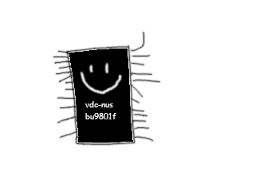

# rugby64 jr. v1

This board repurposes the VDC-NUS (Ricoh BU9801F) for RGB modding Nintendo 64 systems that don't have a VDC-NUS.
It's useful for those who have a million dead N64s laying around, or for those who have spare VDC-NUS chips on hand (lucky bastards).

## Bill of Materials

* Molex 200528-0120 flat flex ribbon connector 
* 10uF 6.3v capacitor, 0803 footprint
* 0.1uF cap, 0603 footprint
* 10k ohm resistor, 0603 footprint
* 4x110 ohm resistor array, 1210 footprint
* VDC-NUS video chip
* Generic 4-pin 2mm pitch vertical SMD pin header (or just solder wires directly to the board)

## Schematic

This was ripped straight from the NUS-CPU-04 schematics floating around the internet, without any attempt to hide its origins.

Don't ask me what VDC-NUS pins 23 and 24 do, I don't think anyone knows. If you want my guesses:
* Pin 24 is part of a power-on reset circuit
* Pin 23 is probably a test pin

## Where to get VDC-NUS chips?

- Dead N64s (NUS-CPU-01 thru NUS-CPU-04, NTSC boards only)
- The Russian Roulette of Chinese chip suppliers (search BU9801F)

Easy way to detect fake chips is to look at the chip itself. It should look like this:

Then, to weed out ones that pass the visual test, grab your multimeter, set it to continuity and make
sure there is continuity between the ground pins: 9, 12, 16, 18, 20, 22. If any of those fail,
you got yourself a fake ass chip. Bin the thing and leave a 1 star review.

Don't bother asking Rohm Semiconductor about this, it's a custom part made specifically for the N64 and they
probably threw any records of it in the dumpster decades ago.