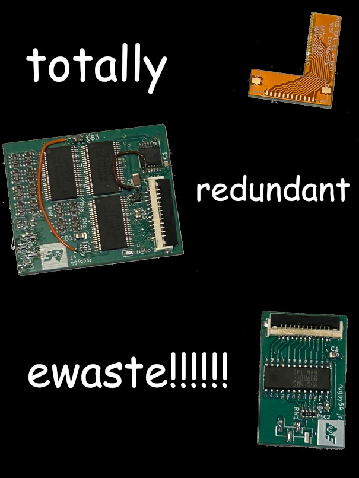

# rugby64: RGB DAC for Nintendo 64s that don't have a RGB DAC

This is what happens when you order a modchip, realise it isn't compatible with your system, and then spend several months trying to justify
your purchase by wasting even more money covering your ass.

This repository contains a suite of PCBs that are used to add analog RGB video output to Nintendo 64 systems that don't
normally support it. Why did I do this? Because, as you may have guessed, I'm an idiot. But also, it was my first experience
working with flat flex and high-speed circuits.

Circuit is entirely discrete logic so you only get the Gerbers.

## Explanation

The Nintendo 64's RCP is responsible for generating video display data, but to save on pin count, it outputs the video signal using
a 7-bit multiplexed interface to a DAC, which in turn is encoded into something you can stuff into a TV. Early run N64s have DACs that output
RGB, which every retro gaming midlife crisis sufferer loves, but on later consoles Nintendo decided to cost-down the A/V circuitry
by having the video DAC output composite or Y/C signals only. PAL users got it worse: not only did they have to use PAL and its
disgusting 50 Hz, but late model PAL N64s often left Y/C out, meaning no S-Video for the unfortunate Eurotrash.

Enabling RGB on your N64 isn't really needed because you can get a decent picture over composite or even S-Video. However, people
want sharp pixels and vivid colors, and scam artists need to prey on niche markets, so N64 RGB mods have become commonplace.
The most common ones target the early model mainboard revisions (NUS-CPU-01 thru -04) as they use the VDC-NUS DAC with analog RGB
outputs. All other NTSC models are the cost-downed revisions using either the AVDC-NUS and MAV-NUS all-in-one audio/video encoders.

So I'm an idiot and I bought one of the RGB amp boards thinking it would be compatible with my Jungle Green N64. Then I took one good
look at the motherboard, saw the text "NUS-CPU-08-1", and was like "yep looks like I fucked up". But rather than learn from my mistake,
or, even worse, try to hunt down an N64 worth modding, I said to myself, "hey this looks like a good weekend project". That sentence,
in my experience, often translates to thousands of dollars flying out the window in pursuit of a working design. And that's exactly
what happened.

## Schematic

[Tim Worthington figured this out decades ago](https://members.optusnet.com.au/eviltim/n64rgb/n64rgb.html) but I'll explain how the N64 VI bus works anyway.

The VI is the Video Interface and it's responsible for generating a digital video signal. The VI bus runs at whatever the pixel
clock is (approx. 50 MHz) and clocks out 7 bits at a time on a multiplexed bus. The basics are:
* D0-D6 are your data inputs
* CLK is the clock signal (duh)
* /DRESET, when low, indicates that the multiplexed message is starting over, and that the SYNC data is arriving on the data bus
* /DRESET toggles on rising edge of clock
* Data is clocked out in the order S/R/G/B
* Data is valid on the falling edge of the clock signal, meaning **the latches should be edge-triggered**
* **DAC logic must switch as fast as possible (ideally in under 10 ns) or you'll get garbage on the outputs**

The VDC-NUS on the original run of NTSC N64s does all of this and spits out analog RGB signals, which are 110-ohm terminated.
A /CSYNC signal is also recovered and sent to the N64's composite sync buffer circuit.

[Tim Worthington's original design](https://members.optusnet.com.au/eviltim/n64rgb/n64rgb.png) implements a similar circuit on a CPLD,
and there have been many variants on it since.

CPLD and FPGA based variants are:
* [Tim's N64RGB circuit](https://etim.net.au/n64rgb/), with deblur, in-game reset, and component video support
* Ikari_01's Verilog implementation
* [Arthrimus's Universal N64 RGB board](https://www.ebay.com/itm/126236778112), which basically does the same thing as Tim's
* UltraHDMI, which is too expensive and difficult to install for most people (*nice "professional installation only" sales point, dorks*)

When implementing this using discrete TTLs (74-series):
* Latches/flip flops should be edge-triggered, transparent latches will not work unless you overcomplicate your design
* The red and green outputs MAY be buffered and output when the blue value changes (an extra 2x8-bit latch)

TTL-based variants are:
* [Michele Perla's design](https://hackaday.io/project/4098-n64-pal-rgb-dac-board)
* [Whatever this guy's variant is called](https://www.ebay.com/itm/175048769698)

## The boards

In the gerbs/ directory you will find the following:

* mavnusadapter: Flat flex PCB to adapt AVDC-NUS and MAV-NUS pinouts to a flat flex ribbon cable
* rugby64jr: Based around the original VDC-NUS chip, which you can salvage from dead or dying N64s
* rugby64: TTL-based, still a work in progress, may never be included or finished due to the high costs

None of these designs use an integrated video amp. The design is intended to be modular so it's
easy to take apart or swap components out. If you want a video amp, you can try Tzorri Mahm's amp or
this shitty ripoff of it.

## Installation

See ordering/assembly directions in Gerbers directories.

You will also need the following:
- 1x flat flex ribbon cable, 12 pins, 1mm pitch, to connect the adapter board to the rugby64
- 1x rectangular cable (or similar), 4 pins, 2mm pitch, to connect the rugby64 to the video amp board

Installation of the adapter board is a long ordeal that will require:
- Soldering station with temperature control (any 936 clone or similar works)
- Fine point soldering bit
- Bevel soldering bit (**required for drag soldering, a normal tip won't work**)
- Unhealthy amount of flux
- 63/37 tin/lead solder
- Magnifying glass, microscope, or similar visual inspection tool
- Digital multimeter with the annoying beepy continuity test

Position the adapter board in place, then stick it onto the N64 PCB. Put the bevel bit on your iron and set the iron to 350 degrees C.
With appropriate flux and solder, drag solder over the joints. Check for faults with multimeter. Test console using composite video.
Find faults. Curse at console. Repeat the process until you ruin the board or make a good connection. Using the fine point tip with
more flux will ensure you make a good connection to each pin.

When testing over composite, check for the following issues:
- No video signal at all: /DRESET or CLK bridged
- Horribly wrong colors: D4-D6 bridged
- Bad hsync/vsync: D0-D3 bridged
- No audio or bad audio: Audio I2S pins bridged (this is possible due to how the adapter board is designed)
- Entire console dead: Ya fucked up big time, but console might still be salvageable
- Lifted traces and broken pins: Throw console in garbage, then throw yourself in the garbage

Once you are convinced that all is well (which, I must repeat, should happen only after you are confident the N64 still works over composite),
apply further adhesive to the adapter board if necessary, then run your wires and test the final RGB video output. Congratulations, you have
installed the rugby64.

**Remember that there's no video amp on the rugby64.** You'll need to send the RGBS outputs to a video amp, and that's what the 4 pin header
is for.

## Why not use a CPLD?

- I'm stupid
- CPLDs require programming and a TTL version of the circuit doesn't, allowing it to be more easily mass produced
- Verilog/VHDL must be recompiled and the board redesigned every time the CPLD changes

## Why not use a RP2040?

- Not enough I/Os
- No onboard DAC
- Needs a flash chip to run
- HDMI using RP2040 likely not possible either, timings are way too tight

## Why not just buy a N64RGB board?

- Cost for one N64RGB board and one flex adapter: $50 USD plus shipping (obviously not ideal for bulk orders)
- Wanted something that could be removed easily in case of disaster (or to return the console to stock)
- It's better business practice to cut out the middleman as much as possible

## But what about in-game reset?

This design shortcoming is easily remedied by following these steps:

1. Remove ass from couch
2. Press Reset button manually

If you need in-game reset due to disability or because you can't move your hideously fat ass,
I'm sorry, but I can't provide it. I have a lot of other projects on the go and I can't afford to
dwell on one for too long (as demonstrated by the rugby64 project easily costing over $1000 due to
numerous false starts). If there's demand, maybe I'll throw some MCU-based solution together,
if one does not already exist.

## B-b-but deblur...

Buy Tim Worthington's board and leave me alone.

## Okay, fine. I'm buying Tim's board. But should I also get my N64 recapped?

General rule of thumb is that unless the capacitors are obviously causing problems (instability, random resets
and board corrosion) you should leave them alone. Save yourself the extra hundred bucks.

## License

Public domain
